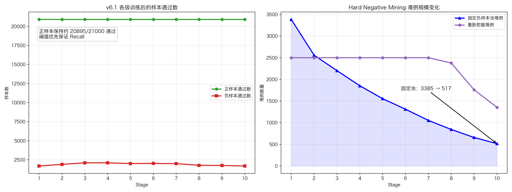
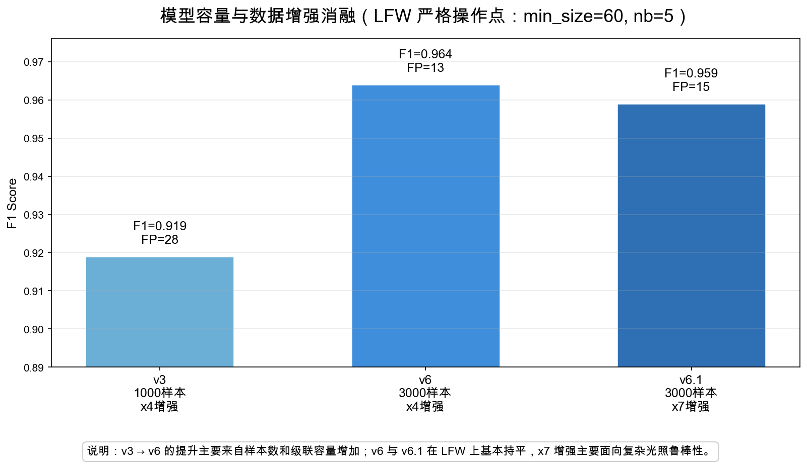
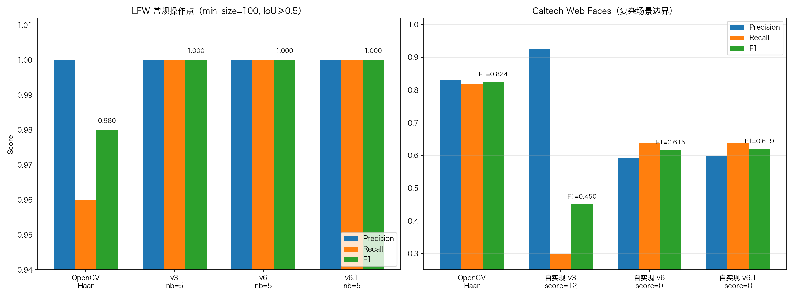
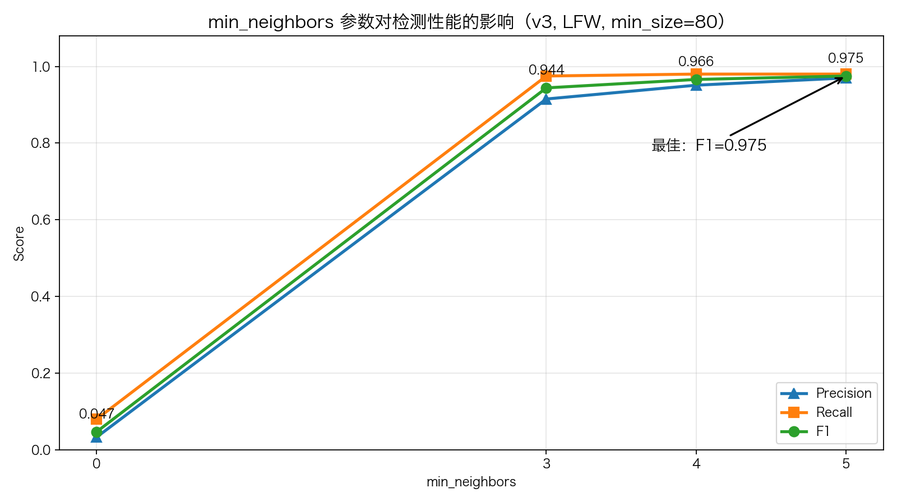
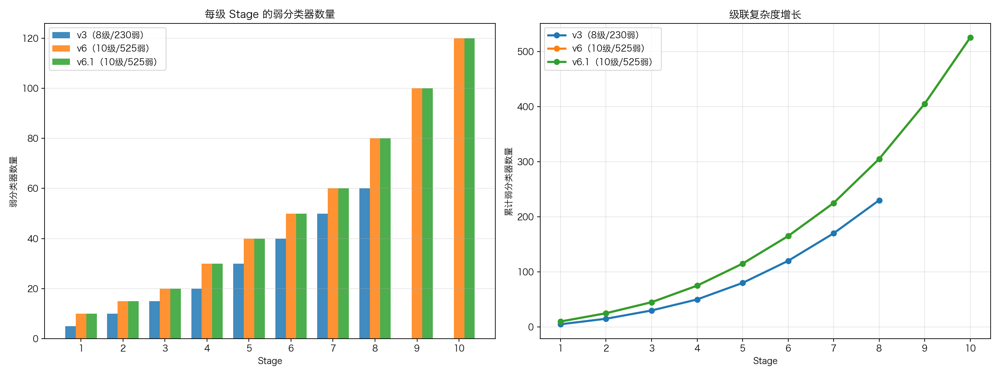
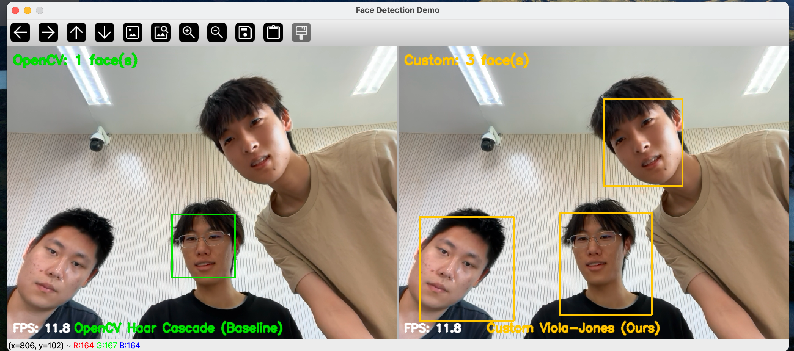

# 基于 Viola-Jones 算法的实时人脸检测系统 - 结题报告

**课程**：计算机视觉

**项目类型**：课程大作业

**小组成员**：龚正硕（2023211729）、谈亮（2023211884）、蒋一鸣（2023211751）

**完成时间**：2026年5月

---

## 目录

1. [系统功能描述](#1-系统功能描述)
2. [系统设计](#2-系统设计)
3. [核心算法设计](#3-核心算法设计)
4. [系统实现](#4-系统实现)
5. [实验](#5-实验)
6. [结论](#6-结论)
7. [参考文献](#7-参考文献)

---

## 1. 系统功能描述

本系统面向课程大作业中的人脸检测任务，目标是在不使用深度学习框架的前提下，从零实现 Viola-Jones 经典检测流程，并完成模型训练、离线评估和实时摄像头演示。报告后续内容将按照“系统功能描述、系统设计、核心算法设计、系统实现、实验、结论”进行组织。

### 1.1 项目目标

1. 从零实现 Viola-Jones 算法：积分图、Haar-like 特征、AdaBoost、级联分类器、多尺度滑动窗口检测、NMS 等核心模块
2. 在标准数据集上评估：使用 LFW 和 Caltech Web Faces 数据集进行定量评估
3. 与 OpenCV 基线对比：在相同测试集上对比自实现检测器与 OpenCV 预训练模型的 Precision、Recall、F1
4. 实时摄像头演示：双屏实时对比，左半屏 OpenCV，右半屏自实现
5. 探索训练策略优化：Hard Negative Mining、自适应级联训练、FP 率约束等

### 1.2 系统功能

系统从模型训练、定量评估到实时演示形成一条完整流程，主要包括以下四部分功能：

| 功能模块         | 入口脚本                       | 功能描述                                                                                                                                      |
| ---------------- | ------------------------------ | --------------------------------------------------------------------------------------------------------------------------------------------- |
| 人脸检测（核心） | `src/`（库）                 | 输入一张图像，输出图中所有正面人脸的边界框（x, y, w, h）。基于自实现的积分图、Haar 特征、AdaBoost、级联、多尺度滑窗和 NMS。                   |
| 模型训练         | `train.py` / `train_v6.py` | 从 WIDER FACE 裁切的正负样本训练级联分类器，支持 Hard Negative Mining、数据增强（×4/×7）、自适应级联、FP 率约束等策略，输出 JSON 格式模型。 |
| 定量评估         | `evaluate.py`                | 在标注数据集（LFW / Caltech）上批量评估，计算 Precision、Recall、F1，并与 OpenCV 预训练模型对比，输出指标 CSV、汇总 JSON 和可视化图片。       |
| 实时演示         | `demo.py`                    | 调用摄像头，双屏并排显示 OpenCV 与自实现检测结果，支持多人脸时间平滑跟踪、暂停（空格）、录制 MP4（`r`）、退出（`q`）。                    |

系统的输入是图像或摄像头视频流，输出是人脸边界框以及两种检测器的对比结果，评价指标为检测精度（P/R/F1）和实时帧率（FPS）。

### 1.3 输入输出与评价目标

系统输入可以是单张图片、标注测试集或摄像头视频流；系统输出为人脸边界框、可视化检测结果、评估指标文件和演示视频。离线评价重点关注 Precision、Recall、F1 和误报/漏检情况，实时演示重点关注检测框稳定性、交互功能和运行帧率。

## 2. 系统设计

系统设计围绕“训练得到可用分类器”和“将分类器部署到评估/演示流程”两条主线展开。训练端负责样本准备、特征计算、AdaBoost 与级联训练；检测端负责图像预处理、多尺度滑动窗口、级联判断、后处理和可视化。

### 2.1 系统总体框架

```
输入图像
    ↓
积分图预计算 ──────────── O(1) 矩形区域求和
    ↓
图像金字塔 + 滑动窗口 ─── 多尺度检测
    ↓  ↓  ↓  ...
┌─ Stage 1 (AdaBoost) ─→ 拒绝约 50% 非人脸窗口
├─ Stage 2 (AdaBoost) ─→ 拒绝更多非人脸窗口
├─ ...
└─ Stage N (AdaBoost) ─→ 通过所有 stage = 人脸候选
    ↓
NMS + 后处理 ──────────── 合并重叠检测框
    ↓
最终检测结果
```

### 2.2 系统模块组成与任务描述

项目采用模块化设计，每个核心组件独立为一个模块：

```
custom/
├── train.py                  # 训练主脚本（v3 及以前）
├── train_v6.py               # v6/v6.1 训练脚本（3000正样本、×7增强）
├── evaluate.py               # 定量评估脚本（支持 --clahe）
├── demo.py                   # 实时摄像头演示（双屏对比 + TrackingBoxSmoother）
├── prepare_data.py           # 训练数据准备（从 WIDER FACE 裁切正样本）
├── prepare_caltech.py        # Caltech 测试集准备
├── audit_cascade.py          # 级联模型审计（分析每级 FPR / TPR）
├── main.py                   # 单屏实时检测入口（OpenCV/Custom 可切换）
├── scripts/                  # 辅助调试脚本（debug/quick_test/tune 等，见 scripts/README.md）
├── src/
│   ├── integral_image.py     # 积分图计算（含平方积分图）
│   ├── haar_features.py      # Haar-like 特征定义与枚举
│   ├── adaboost.py           # AdaBoost 训练与弱/强分类器
│   ├── cascade.py            # 级联分类器（序列化/反序列化）
│   ├── sliding_window.py     # 多尺度滑动窗口 + _cluster_weighted_merge
│   ├── nms.py                # 非极大值抑制 + 包含框过滤
│   ├── detectors.py          # 统一检测器接口（OpenCV / Custom + CLAHE）
│   ├── metrics.py            # 评估指标（IoU匹配、P/R/F1）
│   └── annotations.py        # 标注文件解析
├── models/                   # 训练好的模型（v1 到 v6.1，JSON格式）
├── data/
│   ├── train/                # 训练数据（正/负样本）
│   └── test_lfw/             # LFW 测试集（200张 + annotations）
└── results/                  # 评估结果、可视化图片、训练日志
```

所有核心算法用纯 Python + NumPy 实现，不依赖深度学习框架。


*图 1：项目整体框架图，展示数据、脚本入口、核心算法模块以及从训练到评估、演示的完整流程。*

### 2.3 系统工作流程设计

训练流程为：准备正负样本 → 统一缩放到 24×24 灰度窗口 → 生成 Haar 特征集合 → 预计算特征矩阵 → 逐级训练 AdaBoost 强分类器 → Hard Negative Mining 补充难负样本 → 保存级联模型 JSON。

检测流程为：读取图像/摄像头帧 → 灰度化及可选 CLAHE 预处理 → 构建图像金字塔 → 在每个尺度执行滑动窗口检测 → 级联分类器逐级筛选 → `_cluster_weighted_merge`、NMS 和包含框过滤 → 输出并绘制人脸框。

### 2.4 实时演示设计

实时演示采用双屏对比：左侧显示 OpenCV Haar Cascade 的检测结果，右侧显示自实现 Viola-Jones 模型的检测结果。系统支持暂停、退出和 MP4 录制，并在自实现检测结果上加入多目标时间平滑，使演示时能够直观看到两套检测器在稳定性、漏检和误检上的差异。

## 3. 核心算法设计

本节说明核心算法原理，并结合代码中的实际模块说明实现思路，说明在完成作业的过程中如何理解并实现积分图、Haar 特征、AdaBoost、级联分类器和多尺度检测等。

### 3.1 积分图：把矩形求和降到 O(1)

积分图（Integral Image）是整个 Viola-Jones 流程的加速基础。对灰度图 $I(x,y)$，积分图 $II(x,y)$ 定义为左上角所有像素的累积和：

$$
II(x,y)=\sum_{x' \le x,\;y' \le y} I(x',y')
$$

有了积分图后，任意矩形区域 $R=(x_1,y_1,x_2,y_2)$ 的像素和只需要四次查表：

$$
\text{RectSum}(x_1, y_1, x_2, y_2) = II(x_2, y_2) - II(x_1, y_2) - II(x_2, y_1) + II(x_1, y_1)
$$

项目中这一部分对应 `src/integral_image.py` 的 `compute_integral_image`、`rect_sum` 和 `rect_sums_at`。其中 `rect_sums_at` 是为了滑动窗口批量检测额外实现的向量化版本，可以在同一张积分图上同时计算多个候选窗口的矩形和。

项目还实现了平方积分图 $II_{sq}$，用于在 O(1) 时间内计算窗口方差：

$$
\operatorname{Var}(W)=E[x^2]-E[x]^2
=\frac{1}{n}\sum_{i=1}^{n}x_i^2-\left(\frac{1}{n}\sum_{i=1}^{n}x_i\right)^2
$$

这对应 `src/integral_image.py` 的 `compute_integral_image_sq` 和 `src/sliding_window.py` 的 `_window_stds`。

### 3.2 Haar-like 特征：用亮暗矩形差表达局部结构

Haar-like 特征由若干个带正负权重的矩形区域组成，本质是局部亮暗对比：

$$
f_k(W)=\sum_{r \in \mathcal{R}_k} \omega_r \cdot \text{RectSum}(r),
\quad \omega_r \in \{+1,-1\}
$$

例如 `two_horizontal` 特征把一个矩形分成左右两半，左半权重为 $+1$，右半权重为 $-1$，特征值就是左右区域像素和之差。项目在 `src/haar_features.py` 的 `HaarFeature.weighted_rectangles` 中手写了 5 类特征：

- `two_horizontal`
- `two_vertical`
- `three_horizontal`
- `three_vertical`
- `four`

在 $24 \times 24$ 检测窗口内完整枚举会产生超过 160,000 个候选特征。考虑训练时间成本，本项目使用固定随机种子抽取 20,000 个特征，并把 `feature_count` 保存到模型 JSON 中，保证训练和推理时特征集合一致。

### 3.3 AdaBoost：从大量 Haar 特征中选择少量有效弱分类器

每个弱分类器只依赖一个 Haar 特征，是一个带极性的决策树桩：

$$
h_j(x)=
\begin{cases}
1, & p_j f_j(x) \le p_j \theta_j \\
-1, & \text{otherwise}
\end{cases}
$$

其中 $f_j(x)$ 是第 $j$ 个 Haar 特征，$\theta_j$ 是阈值，$p_j \in \{+1,-1\}$ 是极性。项目中对应 `src/adaboost.py` 的 `WeakClassifier.predict_values`。

AdaBoost 每轮在当前样本权重下选择加权错误率最小的弱分类器：

$$
\epsilon_t=\sum_i w_i \cdot \mathbf{1}\left[h_t(x_i)\ne y_i\right]
$$

然后计算弱分类器权重：

$$
\alpha_t=\frac{1}{2}\ln\frac{1-\epsilon_t}{\epsilon_t}
$$

并更新样本权重：

$$
w_i \leftarrow w_i \exp(-\alpha_t y_i h_t(x_i))
$$

强分类器分数为：

$$
F(x)=\sum_{t=1}^{T}\alpha_t h_t(x)
$$

若 $F(x)\ge \theta_{\text{stage}}$，该 stage 判为人脸候选，否则拒绝。项目中这一过程对应 `src/adaboost.py` 的 `train_adaboost`、`StrongClassifier.decision_function` 和 `StrongClassifier.predict_integral`。

为了避免对每个特征、每个阈值反复遍历所有样本，项目实现了排序扫描法：先对每列特征值排序，再用正负样本权重的累积和一次性扫描所有可能阈值。这个优化位于 `src/adaboost.py` 的 `_find_best_weak_classifier`。

### 3.4 级联分类器：快速拒绝绝大多数非人脸窗口

单个 AdaBoost 强分类器作为一个 stage。多个 stage 串联形成级联：

$$
C(x)=
\begin{cases}
1, & F_s(x)\ge \theta_s,\quad s=1,\dots,S \\
-1, & \exists s,\;F_s(x)<\theta_s
\end{cases}
$$

也就是说，只要任意一级拒绝，窗口立刻被判为非人脸，不再计算后续 stage。项目中对应 `src/cascade.py` 的 `CascadeClassifier.predict_integral` 和 `predict_matrix`。

每级阈值由训练脚本 `train_v6.py` 的 `choose_stage_threshold` 按目标检测率选择。本项目主要采用“保证正样本通过率”的策略：

$$
\theta_s = \operatorname{Quantile}\left(F_s(X^+),\,1-\text{target\_detection\_rate}\right)
$$

这会尽量保证每一级不漏掉正样本；误报率不足的问题则在后处理阶段通过 `min_neighbors` 和 `_cluster_weighted_merge` 补偿。

### 3.5 多尺度滑动窗口与后处理

Haar 特征定义在固定的 $24 \times 24$ 窗口内。为了检测不同大小的人脸，项目采用图像金字塔：在第 $k$ 个尺度上，缩放比例为

$$
\text{scale}_k = \text{scale}_0 \cdot \text{scale\_factor}^k
$$

在缩放后的图像上以步长 `step` 滑动 $24 \times 24$ 窗口，通过级联后再映射回原图坐标：

$$
(x,y,w,h)_{\text{orig}} =
(\text{scale}\cdot x,\;\text{scale}\cdot y,\;\text{scale}\cdot 24,\;\text{scale}\cdot 24)
$$

对应实现是 `src/sliding_window.py` 的 `detect_multiscale` 和 `_predict_windows`。其中 `_predict_windows` 维护 `alive` 掩码，被前面 stage 拒绝的窗口不会再进入后续计算。

最后使用 IoU 做 NMS。两个框 $A,B$ 的交并比为：

$$
\operatorname{IoU}(A,B)=\frac{|A\cap B|}{|A\cup B|}
$$

`src/nms.py` 的 `non_max_suppression` 会按分数从高到低保留候选框，并删除与已保留框 IoU 高于阈值的重复框。针对跨尺度框和包含框问题，项目额外实现了 `remove_contained_boxes` 和 `src/sliding_window.py` 中的 `_cluster_weighted_merge`，这部分是本项目相对标准 Viola-Jones 流程的工程改进。

### 3.6 训练策略设计

#### 3.6.1 Hard Negative Mining

Hard Negative Mining（难例挖掘）是 Viola-Jones 论文中的核心训练技巧，也是本项目中对检测精度提升最大的策略。

思路是：训练完一个 stage 后，当前级联已经能拒绝大部分"简单"负样本。下一个 stage 应该用那些能"骗过"当前级联的难负样本来训练，这样才能学到新东西。

```python
def mine_hard_negatives(directory, cascade, features, window_size,
                        target_count, per_image, rng):
    """从负样本图片中大量随机采样 patch，
    通过当前已训练级联的才是'难例'（hard negative）。"""
    # 1. 过采样：采集 target_count * 5 个候选
    oversample = max(target_count * 5, 1000)
    for path in shuffled:
        if len(candidate_windows) >= oversample:
            break
        gray = read_gray(path)
        h, w = gray.shape
        for _ in range(per_image):
            side = int(rng.integers(window_size, min(h, w) + 1))
            x = int(rng.integers(0, max(1, w - side + 1)))
            y = int(rng.integers(0, max(1, h - side + 1)))
            patch = gray[y : y + side, x : x + side]
            candidate_windows.append(normalize_window(patch, window_size))
            if len(candidate_windows) >= oversample:
                break

    # 2. 计算特征矩阵
    feat_mat = compute_feature_matrix(candidates_arr, features)

    # 3. 用当前级联过滤，只留下通过的（即"难例"）
    predictions = cascade.predict_matrix(feat_mat)
    hard_indices = np.flatnonzero(predictions == 1)

    # 4. 随机选取 target_count 个难例
    chosen = rng.choice(hard_indices,
                        size=min(target_count, len(hard_indices)),
                        replace=False)
    return feat_mat[chosen]
```

由于随着级联层数增加能通过的负样本越来越少，我们过采样 5 倍（`target_count * 5`）再过滤，确保能收集到足够的难例。

训练流程中的难例组合：

```python
# 1. 从固定负样本池里找通过当前级联的"难例"
pool_predictions = cascade.predict_matrix(negative_matrix)
pool_hard_indices = np.flatnonzero(pool_predictions == 1)

# 2. Hard Negative Mining：从真实图片中挖掘额外难例
mined_hard = mine_hard_negatives(
    args.negative_dir, cascade, features, args.window_size,
    target_count=args.active_negatives,
    per_image=args.negatives_per_image * 3,
    rng=rng,
)

# 3. 合并难例，不足时用简单负例填充
hard_parts = [p for p in [mined_hard, pool_hard] if p is not None and len(p) > 0]
if hard_parts:
    all_hard = np.vstack(hard_parts) if len(hard_parts) > 1 else hard_parts[0]
    if len(all_hard) >= args.active_negatives:
        chosen = rng.choice(len(all_hard), args.active_negatives, replace=False)
        active_negative_matrix = all_hard[chosen]
```

难例从两个来源收集：(1) 预计算的固定负样本池（速度快）和 (2) 从原始负样本图片中重新采样挖掘（多样性好）。两者合并后取 `active_negatives` 个用于下一 stage 训练。

#### 3.6.2 阈值选择策略

每级 stage 的阈值选择是 Viola-Jones 训练中最关键的决策之一，它直接决定了检测率（漏检率）和误报率（虚警率）之间的平衡。

```python
def choose_stage_threshold(scores, target_detection_rate,
                           negative_scores=None, max_fp_rate=0.5):
    """按目标通过率选择 stage 阈值。"""
    # 基础策略：保证 target_detection_rate 的正样本通过
    quantile = max(0.0, 1.0 - keep_rate)
    threshold_dr = float(np.quantile(scores, quantile))

    if negative_scores is not None:
        # 可选的 FP 率约束
        threshold_fp = float(np.quantile(negative_scores, max_fp_rate))
        safe_upper = float(np.quantile(scores, 0.05))
        threshold = max(threshold_dr, min(threshold_fp, safe_upper))
        return threshold
    return threshold_dr
```

我们探索了两种阈值策略：

策略 A（仅约束检测率，最终采用）：阈值设为正样本分数的第 0.5% 分位数，确保 ≥99.5% 正样本通过。每级 FP 率不受显式约束（可能高达 90%+），但配合 `min_neighbors` 后处理整体效果最好。

策略 B（同时约束 FP 率）：在保证检测率的基础上将阈值提高到负样本分数的第 50% 分位数，使每级至少拒绝 50% 负样本。更接近论文设计，但实验发现过于激进的阈值会减少重叠检测框数量，导致 `min_neighbors` 后处理失效（详见 5.6.1.4 节 v4 模型的问题）。

策略 B 中还设置了 `safe_upper = np.quantile(scores, 0.05)` 作为阈值上限，保证检测率不低于 95%。

#### 3.6.3 自适应级联训练

我们还实现了自适应级联训练模式：不预先指定每级弱分类器数量，采用动态增加，直到当前 stage 的 FP 率降到目标值以下。

```python
if args.adaptive_stages:
    # 从少量弱分类器开始，逐步加到 FP 率达标
    for try_weaks in [5, 10, 15, 20, 30, 40, 60, 80, 100, 130, 160, 200]:
        stage = train_adaboost(train_matrix, labels, features,
                               num_weaks=try_weaks)
        pos_scores = stage.decision_function(positive_matrix)
        neg_scores = stage.decision_function(active_negative_matrix)
        stage.threshold = choose_stage_threshold(pos_scores,
                                                  args.stage_detection_rate)
        fp_rate = float(np.mean(neg_scores >= stage.threshold))
        print(f"  try {try_weaks:3d} weaks → FP rate={fp_rate:.3f}")
        if fp_rate <= args.target_fp_rate:
            break
```

**设计思路**：

- 前几级 stage 通常只需要 5-10 个弱分类器就能达到 50% 的 FP 率目标（因为简单负样本很容易区分）
- 后面的 stage 面对的都是难例，可能需要 60-100 甚至更多弱分类器才能达标
- 如果达到 200 个弱分类器仍未达标，就使用当前最好的结果继续

这种方式比固定 `--stage-sizes 10,20,40` 更灵活，能够根据实际的数据难度自动调整每级的复杂度。



*图 6：v6.1 训练日志可视化。随着 stage 增加，负样本通过数和难例池规模逐步下降，说明级联在不断聚焦更难的负样本。*

#### 3.6.4 数据增强

##### v3 模型：×4 增强

```python
def augment_windows(windows, rng):
    """数据增强：水平翻转 + 亮度扰动，正样本量 ×4。"""
    flipped  = windows[:, :, ::-1].copy()      # 水平翻转
    darker   = np.clip(windows * 0.82, 0, 255)  # 暗化 18%
    brighter = np.clip(windows * 1.18, 0, 255)  # 亮化 18%
    return np.concatenate([windows, flipped, darker, brighter], axis=0)
```

##### v6.1 模型：×7 增强

在 v6.1 模型中，我们将数据增强从 ×4 扩展到 ×7，新增 gamma 校正和高斯噪声两种变换：

```python
def augment_windows_v7(windows, rng):
    """×7 增强：翻转 + 亮度 + gamma + 噪声。"""
    flipped  = windows[:, :, ::-1].copy()
    darker   = np.clip(windows * 0.82, 0, 255)
    brighter = np.clip(windows * 1.18, 0, 255)
    # gamma 校正：模拟非线性光照变化
    gamma_low  = np.clip(255 * (windows / 255) ** 1.5, 0, 255)
    gamma_high = np.clip(255 * (windows / 255) ** 0.7, 0, 255)
    # 高斯噪声：增强鲁棒性
    noise = rng.normal(0, 8, windows.shape)
    noisy = np.clip(windows + noise, 0, 255)
    return np.concatenate([windows, flipped, darker, brighter,
                           gamma_low, gamma_high, noisy], axis=0)
```

新增变换的考量：

- Gamma 校正（γ=1.5 和 γ=0.7）：模拟相机曝光差异的非线性亮度变化
- 高斯噪声（σ=8）：增强对传感器噪声和 JPEG 压缩伪影的鲁棒性

增强策略的约束：

- 水平翻转：正面人脸左右对称，翻转后仍是有效正样本
- 亮度扰动幅度不宜过大（±18%），否则破坏 Haar 特征的区分能力
- 不做旋转：Viola-Jones 针对正面人脸设计，旋转后引入噪声标签

从 v6（×4，12000样本）到 v6.1（×7，21000样本），级联结构保持不变（10 级 / 525 弱），仅训练数据多样性增加。在 LFW 上两者基本持平（差异在统计噪声内，见 5.6.2），×7 增强带来的 gamma/噪声鲁棒性主要在光照复杂的实时摄像头场景中体现。



*图 7：模型容量与数据增强的消融结果。图中使用 LFW 严格操作点（min_size=60, nb=5），标出了各模型的 F1 和误报数；v6.1 在 ×7 增强下与 v6 表现接近，说明 gamma 校正与噪声扰动在 LFW 这类规整正脸数据上收益有限。*

## 4. 系统实现

系统实现遵循前述模块划分。核心算法均由 Python 和 NumPy 编写，OpenCV 主要用于图像读取、缩放、摄像头采集和窗口显示。

### 4.1 积分图模块实现

积分图的实现利用 NumPy 的 `cumsum` 操作，返回时在左侧和上方各补一行/列零，这样矩形求和时不需要单独处理边界条件：

```python
def compute_integral_image(image: np.ndarray) -> np.ndarray:
    gray = np.asarray(image, dtype=np.float64)
    integral = gray.cumsum(axis=0).cumsum(axis=1)
    return np.pad(integral, ((1, 0), (1, 0)), mode="constant")
```

矩形区域求和统一用四点公式：

```python
def rect_sum(integral, x, y, width, height):
    x1, y1 = int(x), int(y)
    x2, y2 = x1 + int(width), y1 + int(height)
    return float(integral[y2, x2] - integral[y1, x2]
               - integral[y2, x1] + integral[y1, x1])
```

为了加速检测阶段的批量计算，我们实现了 `rect_sums_at`，利用 NumPy 高级索引一次性计算所有滑窗位置的矩形和，避免 Python 层面的逐窗口循环：

```python
def rect_sums_at(integral, xs, ys, width, height):
    x1 = np.asarray(xs, dtype=np.int64)
    y1 = np.asarray(ys, dtype=np.int64)
    x2 = x1 + int(width)
    y2 = y1 + int(height)
    return integral[y2, x2] - integral[y1, x2] \
         - integral[y2, x1] + integral[y1, x1]
```

### 4.2 Haar-like 特征模块实现

#### 4.2.1 特征定义

每个 Haar 特征由类型（kind）、位置（x, y）和尺寸（width, height）定义，通过 `weighted_rectangles` 方法拆分为带权重的矩形区域：

```python
@dataclass(frozen=True)
class HaarFeature:
    kind: str
    x: int
    y: int
    width: int
    height: int

    def weighted_rectangles(self, offset_x=0, offset_y=0):
        """返回该 Haar 特征拆成的若干加权矩形区域。"""
        x = self.x + offset_x
        y = self.y + offset_y
        w, h = self.width, self.height

        if self.kind == "two_horizontal":
            half = w // 2
            return [(x, y, half, h, 1.0), (x + half, y, half, h, -1.0)]
        if self.kind == "four":
            half_w = w // 2
            half_h = h // 2
            return [
                (x, y, half_w, half_h, 1.0),
                (x + half_w, y, half_w, half_h, -1.0),
                (x, y + half_h, half_w, half_h, -1.0),
                (x + half_w, y + half_h, half_w, half_h, 1.0),
            ]
```

使用 `frozen=True` 的 `dataclass`，使 HaarFeature 可哈希，方便在模型加载后将弱分类器的特征映射回特征矩阵的列索引。

#### 4.2.2 特征枚举与采样

```python
def generate_haar_features(window_size=24, max_features=8000, seed=42):
    features = list(_all_features(window_size))  # 枚举所有合法特征
    if max_features >= len(features):
        return features
    rng = np.random.default_rng(seed)
    indices = rng.choice(len(features), size=max_features, replace=False)
    indices.sort()
    return [features[int(index)] for index in indices]
```

特征采样使用固定种子 `seed=42`，保证训练和检测时使用完全相同的特征集合。模型 JSON 中保存了 `feature_count`，加载时用相同种子重新生成特征列表即可恢复映射关系。

说明：上面代码片段展示的是函数默认参数；本文最终报告的 v3/v6/v6.1 模型在训练命令中通过 `--max-features 20000` 覆盖默认值，因此模型 JSON 中的 `feature_count` 均为 20000。

#### 4.2.3 特征矩阵预计算

训练时，先一次性计算所有样本在所有特征上的值，形成特征矩阵：

```python
def compute_feature_matrix(windows, features, dtype=np.float32):
    """为训练窗口计算特征矩阵：一行一个样本，一列一个 Haar 特征。"""
    integrals = compute_integral_images(windows)
    matrix = np.empty((len(windows), len(features)), dtype=dtype)
    for column, feature in enumerate(features):
        matrix[:, column] = feature.values(integrals)
    return matrix
```

这样 AdaBoost 训练时就不需要反复计算特征值，只需要在预计算好的矩阵上进行列选择和排序操作。


*图 2：v6.1 模型中按 `|alpha|` 排序靠前的 Haar-like 特征，大多落在人脸区域的局部亮暗对比上。*


*图 3：训练后弱分类器中不同 Haar 特征类型的占比，用于观察 AdaBoost 最终偏好的特征结构。*

### 4.3 AdaBoost 训练实现

#### 4.3.1 弱分类器选择：排序扫描法

朴素方法对每个特征的每个阈值遍历所有样本，复杂度 $O(N^2 F)$。我们采用预排序 + 累积和扫描：

```python
def _find_best_weak_classifier(feature_matrix, labels, weights,
                                features, sorted_indices, selected,
                                batch_size=512):
    # 预先排好的索引
    order = sorted_indices[:, start:end]
    sorted_labels = labels[order]
    sorted_weights = weights[order]

    # 累积正/负样本权重
    positive_left = np.cumsum(
        np.where(sorted_labels == 1, sorted_weights, 0.0), axis=0)
    negative_left = np.cumsum(
        np.where(sorted_labels == -1, sorted_weights, 0.0), axis=0)

    # 两种极性的加权错误率——一次扫描同时评估两种极性
    error_pos_left = negative_left + (total_positive - positive_left)
    error_pos_right = positive_left + (total_negative - negative_left)
    errors = np.minimum(error_pos_left, error_pos_right)
```

主要优化手段：(1) 训练前对每个特征预排序，后续每轮只需按序累积权重；(2) `cumsum` 一次性算出所有阈值位置的错误率；(3) 每批处理 512 列特征，利用矩阵运算并行；(4) 已选特征标记跳过。

#### 4.3.2 权重更新

```python
clipped_error = min(max(error, 1e-12), 1.0 - 1e-12)
alpha = 0.5 * np.log((1.0 - clipped_error) / clipped_error)

predictions = weak.predict_values(feature_matrix[:, feature_index])
weights *= np.exp(-alpha * labels * predictions)
```

错误率裁剪到 $[10^{-12}, 1 - 10^{-12}]$，防止完美分类时 $\alpha \to \infty$。


*图 4：AdaBoost 弱分类器权重 `alpha` 的分布。权重越大，说明该弱分类器在强分类器中的贡献越明显。*

### 4.4 级联分类器实现

#### 4.4.1 级联结构

```python
@dataclass
class CascadeClassifier:
    stages: list[StrongClassifier]  # 每级是一个 AdaBoost 强分类器
    window_size: int = 24
    feature_count: int = 0          # 训练时使用的特征数量

    def predict_integral(self, integral, x=0, y=0):
        """在一张积分图的指定窗口位置执行级联检测。"""
        score = 0.0
        for stage in self.stages:
            score = stage.score_integral(integral, x, y)
            if score < stage.threshold:
                return False, score   # 任一级拒绝即返回
        return True, score            # 通过所有级 → 人脸候选
```

级联的拒绝逻辑：只要某一级分数低于阈值就立即返回"非人脸"，不再进入后续 stage。

#### 4.4.2 模型序列化

训练好的级联保存为 JSON 格式，便于跨平台加载和人类可读：

```json
{
  "type": "teaching_viola_jones_cascade",
  "window_size": 24,
  "feature_count": 20000,
  "stages": [
    {
      "threshold": -3.141592,
      "weak_classifiers": [
        {
          "feature": {"kind": "two_horizontal", "x": 5, "y": 3, "width": 14, "height": 8},
          "threshold": 1234.5,
          "polarity": 1,
          "alpha": 0.732
        }
      ]
    },
  ]
}
```

模型 JSON 中保存了 `feature_count` 字段。加载时用相同种子和数量重新生成特征列表，将弱分类器映射回列索引，避免在 JSON 中存储完整的 20000 个特征定义。


*图 5：不同 stage 中弱分类器数量的分布。后级通常面对更难的负样本，因此需要更多弱分类器来完成区分。*

### 4.5 多尺度滑动窗口检测实现

这是将训练好的级联模型应用到实际图像上的核心模块：

```python
def detect_multiscale(gray, cascade, scale_factor=1.2, step=4,
                      min_size=30, nms_threshold=0.3,
                      min_neighbors=0, score_threshold=0.0,
                      variance_normalize=True):
    """在图像金字塔上用手写 cascade 进行多尺度人脸检测。"""
    window = cascade.window_size
    scale = max(float(min_size) / float(window), 1.0)

    while True:
        resized_w = int(round(w / scale))
        resized_h = int(round(h / scale))
        if resized_w < window or resized_h < window:
            break

        # 缩放图像并计算积分图
        resized = cv2.resize(gray, (resized_w, resized_h),
                             interpolation=cv2.INTER_AREA)
        integral = compute_integral_image(resized)
        integral_sq = compute_integral_image_sq(resized) \
                      if variance_normalize else None

        # 生成滑窗网格
        ys_grid, xs_grid = np.mgrid[
            0 : resized_h - window + 1 : step,
            0 : resized_w - window + 1 : step
        ]
        xs = xs_grid.ravel().astype(np.int64)
        ys = ys_grid.ravel().astype(np.int64)

        # 批量预测
        passed, cum_scores = _predict_windows(cascade, integral,
                                               integral_sq, xs, ys)

        # 分数阈值过滤
        if score_threshold > 0.0:
            passed = passed & (cum_scores >= score_threshold)

        # 映射回原图坐标
        for x, y, score in zip(xs[passed], ys[passed],
                                cum_scores[passed]):
            boxes.append((
                int(round(int(x) * scale)),
                int(round(int(y) * scale)),
                int(round(window * scale)),
                int(round(window * scale)),
                float(score),
            ))
        scale *= scale_factor
```

#### 4.5.1 批量预测优化

逐窗口调用 `predict_integral` 在 Python 中开销较高。我们实现了 `_predict_windows` 函数，在同一尺度下对所有滑窗位置进行**批量向量化预测**：

```python
def _predict_windows(cascade, integral, integral_sq, xs, ys):
    """批量预测同一尺度下的多个滑窗。"""
    alive = np.ones(len(xs), dtype=bool)
    cumulative_scores = np.zeros(len(xs), dtype=np.float64)

    # 预计算方差归一化因子
    if integral_sq is not None:
        stds = _window_stds(integral, integral_sq, xs, ys,
                            cascade.window_size)

    for stage in cascade.stages:
        alive_indices = np.flatnonzero(alive)
        if alive_indices.size == 0:
            break
        stage_scores = np.zeros(alive_indices.size, dtype=np.float64)
        active_xs = xs[alive_indices]
        active_ys = ys[alive_indices]
        for weak in stage.weak_classifiers:
            # 利用 values_at 批量计算所有活跃窗口的特征值
            values = weak.feature.values_at(integral, active_xs, active_ys)
            if stds is not None:
                values = values / stds[alive_indices]
            stage_scores += weak.alpha * weak.predict_values(values)
        cumulative_scores[alive_indices] += stage_scores
        alive[alive_indices[stage_scores < stage.threshold]] = False
    return alive, cumulative_scores
```

这里的关键是用 `alive` 掩码做逐级剪枝：被前面 stage 拒绝的窗口不再参与后续计算，再配合 `values_at` 的向量化特征计算，使 Python 实现能够达到实验演示所需的速度。

#### 4.5.2 方差归一化

Viola-Jones 论文 Section 2.2 指出，为了使检测时的特征值分布与训练时一致，需要对每个检测窗口做方差归一化。我们用积分图和平方积分图在 O(1) 时间内计算每个窗口的像素标准差：

```python
def _window_stds(integral, integral_sq, xs, ys, window_size):
    """用积分图和平方积分图批量计算各滑窗的像素标准差。"""
    n = window_size * window_size
    mean = rect_sums_at(integral, xs, ys, window_size, window_size) / n
    mean_sq = rect_sums_at(integral_sq, xs, ys,
                           window_size, window_size) / n
    var = mean_sq - mean ** 2
    return np.sqrt(np.maximum(var, 1e-8))  # 防止除以零
```

然后在预测时将特征值除以标准差：`values = values / stds[alive_indices]`。

实际使用中，由于我们在原始像素值上训练（不做方差归一化），检测时开启方差归一化反而降低性能（训练和检测不一致）。最终版本关闭了方差归一化（`variance_normalize=False`）。

#### 4.5.3 CLAHE 自适应直方图均衡化预处理

在评估阶段，我们在 `detectors.py` 的 `CustomCascadeDetector.detect()` 中引入了可选的 CLAHE（Contrast Limited Adaptive Histogram Equalization）预处理：

```python
if options.get("clahe", False):
    clahe = cv2.createCLAHE(clipLimit=2.0, tileGridSize=(8, 8))
    gray = clahe.apply(gray)
```

CLAHE 对图像做局部对比度增强，在光照不均匀时使 Haar 特征响应更稳定。实验效果（LFW 严格操作点，详见 5.6.2）：

- v3（较弱模型）+ CLAHE：F1 0.919→0.933，误报减少（CLAHE 有益）
- v6/v6.1（较强模型）+ CLAHE：F1 反而下降约 0.02，误报增多（CLAHE 放大背景噪声，有害）

因此 CLAHE 仅作为可选项保留，最终部署的 v6.1 默认关闭 CLAHE。这个结果说明，预处理增强需要与模型能力和训练分布匹配。

### 4.6 后处理实现：NMS 与重叠框过滤

多尺度检测会产生大量重叠的候选框，需要通过后处理合并为最终检测结果。

#### 4.6.1 非极大值抑制（NMS）

```python
def non_max_suppression(boxes, threshold=0.3):
    """保留高分框，去掉与其高度重叠的重复框。"""
    def score(box):
        return float(box[4]) if len(box) >= 5 else float(box[2] * box[3])

    candidates = sorted(boxes, key=score, reverse=True)
    selected = []
    for box in candidates:
        if all(intersection_over_union(box, kept) < threshold
               for kept in selected):
            selected.append(box)
    return remove_contained_boxes(selected)
```

NMS 的逻辑是：按分数从高到低排序，依次检查每个框是否与已保留的框有高 IoU 重叠。如果重叠度超过阈值（0.3），则认为是同一个检测目标的重复框，予以丢弃。

#### 4.6.2 包含框过滤

在实际测试中，我们发现仅靠 NMS 无法处理一种常见的误检情况：**小区域（如眼睛、鼻子）被误检为人脸**。这些小框通常完全被真正的人脸大框包含，但 IoU 不一定很高（因为面积差距大），NMS 无法有效过滤。

为此我们额外实现了 `remove_contained_boxes`：

```python
def remove_contained_boxes(boxes, coverage=0.5):
    """如果小框的大部分面积被某个大框覆盖，删掉小框。"""
    keep = []
    for i, a in enumerate(boxes):
        ax, ay, aw, ah = a[:4]
        a_area = aw * ah
        contained = False
        for j, b in enumerate(boxes):
            if i == j:
                continue
            bx, by, bw, bh = b[:4]
            b_area = bw * bh
            if b_area <= a_area:
                continue  # 只看比自己大的框
            # 计算交集
            inter = max(0, min(ax+aw, bx+bw) - max(ax, bx)) * \
                    max(0, min(ay+ah, by+bh) - max(ay, by))
            if a_area > 0 and inter / a_area >= coverage:
                contained = True
                break
        if not contained:
            keep.append(a)
    return keep
```

这里用的是交集占小框面积的比例（而非 IoU）。一个 30×30 的小框被 150×150 的大框完全包含时，IoU 只有约 4%（NMS 不会过滤），但覆盖率是 100%，会被正确删除。

#### 4.6.3 自定义聚类合并：_cluster_weighted_merge

在实时演示调试过程中，我们发现 `cv2.groupRectangles` 存在几个局限：

1. eps 参数过于严格，相邻尺度的检测框尺寸差异超过 eps 时无法归为同组
2. 不利用分数信息，简单取组内平均
3. scale_factor=1.2 时同一人脸在相邻尺度的框大小差 20%，IoU 可能低于合并阈值

为此我们在 `sliding_window.py` 中设计了自定义的 `_cluster_weighted_merge` 算法。下面摘录的是项目中的代码段：

```python
def _cluster_weighted_merge(boxes, iou_merge=0.18, min_count=2):
    def same_face_cluster(a: tuple, b: tuple) -> bool:
        area_a = a[2] * a[3]
        area_b = b[2] * b[3]
        ref_size = max(a[2], a[3], b[2], b[3], 1)
        size_ratio = min(area_a, area_b) / max(area_a, area_b, 1)
        return (
            intersection_over_union(a, b) >= iou_merge
            or containment(a, b) >= 0.65
            or (center_distance(a, b) <= ref_size * 0.38 and size_ratio >= 0.35)
        )

    for box in sorted(boxes, key=lambda item: item[4], reverse=True):
        for cluster in clusters:
            if any(same_face_cluster(box, member) for member in cluster):
                cluster.append(box)
                break
        else:
            clusters.append([box])

    for cluster in clusters:
        if len(cluster) < min_count:
            continue
        min_score = min(box[4] for box in cluster)
        weights = [max(box[4] - min_score + 1e-3, 1e-3) for box in cluster]
        total_weight = sum(weights)
        cx = sum((box[0] + box[2] / 2) * weight
                 for box, weight in zip(cluster, weights, strict=False)) / total_weight
        cy = sum((box[1] + box[3] / 2) * weight
                 for box, weight in zip(cluster, weights, strict=False)) / total_weight

        sorted_widths = sorted(box[2] for box in cluster)
        size_index = max(0, int(round(0.75 * (len(cluster) - 1))))
        w = sorted_widths[size_index]
```

设计思路：

1. 三条件聚类：单纯 IoU 无法处理跨尺度框。60×60 和 80×80 的框 IoU 可能只有 0.15，但小框 65% 面积被大框覆盖（条件2），或中心距离仅占参考尺寸 30%（条件3），仍应归为同一人脸。
2. 分数加权合并位置，75% 分位数取尺寸（避免小窗口拉偏加权平均）。
3. min_count 过滤：孤立误检通常只有 1-2 个框，真正的人脸在多尺度检测中会产生大量重叠框。v3 设 `min_count=3`，v6 设 `min_count=10`。

**调用方式**：

```python
if min_neighbors > 0:
    merged = _cluster_weighted_merge(boxes, iou_merge=0.18, min_count=min_neighbors)
    return [box[:4] for box in non_max_suppression(merged, threshold=nms_threshold)]
```

相比 groupRectangles，该算法在实时摄像头测试中减少了跨尺度误分簇，人脸框的稳定性也更好。

### 4.7 训练数据准备实现

训练数据的准备是整个项目的第一步。

**正样本处理流程**：

1. 从 WIDER FACE 数据集中裁切标注的人脸区域
2. 缩放到 24×24 灰度图
3. 可选地进行数据增强（翻转 + 亮度扰动）

**负样本采样策略**：

```python
def sample_negative_windows(directory, window_size, total_samples,
                            per_image, seed):
    """从非人脸图片中随机裁剪负样本 patch。"""
    rng = np.random.default_rng(seed)
    windows = []
    paths = image_paths(directory)
    shuffled = paths.copy()
    rng.shuffle(shuffled)
    while len(windows) < total_samples:
        for path in shuffled:
            gray = read_gray(path)
            h, w = gray.shape[:2]
            for _ in range(max(1, per_image)):
                side = int(rng.integers(max(8, min(h, w) // 5), min(h, w) + 1))
                x = int(rng.integers(0, w - side + 1))
                y = int(rng.integers(0, h - side + 1))
                patch = gray[y : y + side, x : x + side]
                windows.append(normalize_window(patch, window_size))
                if len(windows) >= total_samples:
                    break
            if len(windows) >= total_samples:
                break
```

随机裁切时 patch 边长在 $[\max(8, \frac{\min(h,w)}{5}),\; \min(h,w)]$ 范围内随机选取，保证负样本涵盖从小纹理到大块区域的各种尺度。

### 4.8 界面实现：双屏实时对比

实时演示系统将 OpenCV 预训练模型和自实现模型的检测结果并排显示在同一窗口中：

```python
def main():
    # 加载两个检测器
    opencv_det = create_detector("opencv")
    custom_det = create_detector("custom", model_path)

    while True:
        ret, frame = cap.read()

        # OpenCV 检测（左半屏）
        left = frame.copy()
        _, opencv_boxes = opencv_det.detect(frame, options_opencv)
        draw_detections(left, opencv_boxes, (0, 220, 0), "OpenCV")

        # 自实现检测（右半屏）
        right = frame.copy()
        _, custom_boxes = custom_det.detect(frame, options_custom)
        custom_boxes = custom_smoother.update(custom_boxes)
        draw_detections(right, custom_boxes, (0, 200, 255), "Custom")

        # 拼接并显示
        combined = np.hstack([left, right])
        cv2.imshow("Face Detection Demo", combined)
```

**交互功能**：

- **按 `q`**：退出
- **按 `r`**：开始/停止录制（保存为 MP4）
- **按空格**：暂停/继续

### 4.9 界面实现：时间平滑与多人跟踪

在实际摄像头测试中，我们遇到了两个问题：(1) 检测框在帧间剧烈抖动；(2) 多人场景下需要独立跟踪每张脸。

原因分析：Viola-Jones 的滑动窗口在不同帧里会选中不同的窗口位置（步长和尺度都是离散的），框坐标因此帧间跳动。而早期的 BoxSmoother 只取最大框，处理不了多人脸场景。

解决办法是多目标跟踪加自适应 EMA。我们在 `demo.py` 中实现了 `TrackingBoxSmoother`，支持多人脸独立跟踪：

```python
class TrackingBoxSmoother:
    """多人脸时间平滑：独立跟踪每张脸。"""

    def __init__(self, alpha=0.65, max_lost=2, max_tracks=8):
        self.alpha = alpha
        self.max_lost = max_lost
        self.max_tracks = max_tracks
        self.tracks = []  # 每个 track: {box, lost, matched}

    def _match_score(self, track_box, detection):
        """匹配评分：IoU 为主，距离为辅。"""
        iou = box_iou(track_box, detection)
        dist = TrackingBoxSmoother._center_distance(track_box, detection)
        ref_size = max(track_box[2], track_box[3], detection[2], detection[3], 1)
        return iou - 0.25 * (dist / ref_size)

    def update(self, boxes):
        detections = sorted(boxes, key=lambda b: b[2] * b[3],
                            reverse=True)[: self.max_tracks]
        unmatched = set(range(len(detections)))

        for track in self.tracks:
            track["matched"] = False
            if not unmatched:
                break
            best_idx = max(unmatched, key=lambda idx:
                           self._match_score(track["box"], detections[idx]))
            best_box = detections[best_idx]
            iou = box_iou(track["box"], best_box)
            dist = self._center_distance(track["box"], best_box)
            ref_size = max(track["box"][2], track["box"][3],
                           best_box[2], best_box[3], 1)
            if iou >= 0.08 or dist <= ref_size * 0.9:
                alpha = 0.9 if dist > ref_size * 0.45 else self.alpha
                track["box"] = self._smooth(track["box"], best_box, alpha)
                track["lost"] = 0
                track["matched"] = True
                unmatched.remove(best_idx)

        for idx in unmatched:
            self.tracks.append({"box": tuple(detections[idx][:4]),
                                "lost": 0, "matched": True})

        kept = []
        for track in self.tracks:
            if not track["matched"]:
                track["lost"] += 1
            if track["lost"] <= self.max_lost:
                kept.append(track)
        self.tracks = kept[: self.max_tracks]
        return [track["box"] for track in self.tracks if track["lost"] == 0]
```

设计要点：

1. 每个 track 独立维护平滑状态，支持同时跟踪最多 8 张脸。
2. 匹配评分：`IoU - 0.25 × (distance/ref_size)`，当 IoU ≥ 0.08 或距离 ≤ 参考尺寸 × 0.9 时认为匹配成功。
3. 自适应 alpha：中心距离超过参考尺寸 45% 时用 α=0.9 快速跟上，否则用 α=0.65 平滑。
4. max_lost=2：连续 2 帧未匹配的 track 被删除，减少残留检测框。

与早期 BoxSmoother 的对比：

| 特性     | BoxSmoother        | TrackingBoxSmoother   |
| -------- | ------------------ | --------------------- |
| 多人脸   | 只取最大框         | 独立跟踪 8 张脸       |
| 平滑策略 | 固定 α=0.4        | 自适应 α（0.65/0.9） |
| 匹配方式 | 无（取最大框）     | IoU + 距离组合评分    |
| 丢失容忍 | 5 帧（易残留旧框） | 2 帧（更快清除误检）  |

## 5. 实验

实验部分分为核心算法评价和系统测试两部分。核心算法评价包括数据集、实验环境、参数设置、指标结果、消融实验和问题分析；系统测试包括实时界面功能、运行过程和性能表现。

### 5.1 实验数据

#### 5.1.1 训练数据

**正样本来源：WIDER FACE 数据集**

WIDER FACE 是目前学术界广泛使用的人脸检测基准数据集之一，包含 32,203 张图片和 393,703 个标注人脸。我们从中筛选并裁切较清晰的人脸区域作为正样本。

```
v3 模型:
  训练正样本: 1000 张人脸裁切图（24×24 灰度窗口）
  数据增强后: 4000 张（水平翻转 + 亮度扰动 ×4）
  训练负样本: 2500 个随机裁切 patch

v6/v6.1 模型:
  训练正样本: 3000 张人脸裁切图（24×24 灰度窗口）
  v6 增强后: 12000 张（×4：翻转 + 亮度扰动）
  v6.1 增强后: 21000 张（×7：翻转 + 亮度 + gamma校正 + 高斯噪声）
  训练负样本: 2500 个随机裁切 patch
  每级活跃负样本: 1200 个（含 Hard Negative Mining 难例）
```

**负样本来源**：从不包含人脸的自然场景图片中随机裁切不同尺度的 patch。每张负样本图片随机裁切 20 个不同大小和位置的 patch，统一缩放到 24×24 作为负样本窗口。

#### 5.1.2 测试数据

**LFW（Labeled Faces in the Wild）**：

- 200 张标注图片
- 主要为正面人脸照片，背景相对简单
- 适合评估正面人脸检测的基本能力

**Caltech Web Faces**：

- 包含多角度、多遮挡、多光照的复杂场景
- 难度明显高于 LFW
- 含有大量侧脸、小脸和遮挡情况

#### 5.1.3 数据预处理

所有训练图片在加载时执行以下处理：

```python
def normalize_window(gray: np.ndarray, window_size: int) -> np.ndarray:
    """把任意大小的训练 patch 统一缩放为固定窗口大小。"""
    resized = cv2.resize(gray, (window_size, window_size),
                         interpolation=cv2.INTER_AREA)
    return resized.astype(np.float32)
```

这里有一个设计选择：训练阶段直接使用原始像素值（0-255），没有做方差归一化。这样训练流程更简单；从后续实验看，在当前数据和参数设置下，配合 `min_neighbors`、`score_threshold` 等后处理可以得到可接受的检测效果。

### 5.2 实验环境

#### 5.2.1 硬件环境

**本地开发环境**：

- CPU: Intel Core i7
- GPU: NVIDIA RTX（用于一般开发，本项目不使用 GPU 加速）
- 内存: 16GB DDR4
- 操作系统: Windows 11

**服务器训练环境（AutoDL）**：

- GPU: NVIDIA RTX 3090
- 用于训练较大的级联模型（v5 自适应版本等）

#### 5.2.2 软件环境

**核心依赖**：

```
Python 3.11
numpy 1.24+
opencv-python 4.8+
```

本项目不依赖任何深度学习框架（PyTorch、TensorFlow 等），所有核心算法用 NumPy 从零实现，仅使用 OpenCV 进行图像读取、缩放和窗口显示。

### 5.3 核心算法评价：指标与复现命令

**评估指标**：

- **Precision（精确率）**：检测结果中正确检测的比例，$P = \frac{TP}{TP + FP}$
- **Recall（召回率）**：真实人脸中被检测到的比例，$R = \frac{TP}{TP + FN}$
- **F1 Score**：P 和 R 的调和平均，$F1 = \frac{2PR}{P + R}$
- **IoU 阈值**：检测框与真实框的 IoU ≥ 0.5 视为正确检测

这里的“正确检测”不是要求预测框和标注框完全一致，而是用交并比（Intersection over Union, IoU）判断：

$$
\operatorname{IoU}(A,B)=\frac{|A\cap B|}{|A\cup B|}
$$

评估时每个预测框会和未匹配过的真实框计算 IoU，并选择 IoU 最大的真实框。如果最大 IoU ≥ 0.5，则该预测框记为一个 TP；如果预测框没有匹配到任何真实框，则记为 FP；如果某个真实框最后没有被任何预测框匹配，则记为 FN。匹配关系是一对一的，因此同一张脸周围多出来的重复框会被记为额外 FP。

**复现命令**（结果写入 `results/` 对应子目录）：

```bash
# OpenCV 基线
python evaluate.py --detector opencv \
    --image-dir data/test_lfw/images --annotations data/test_lfw/annotations.json \
    --output-dir results/eval_lfw_opencv
# 自实现 v6.1（常规操作点 min_size=100）
python evaluate.py --detector custom --model models/custom_cascade_v6_full_1.json \
    --image-dir data/test_lfw/images --annotations data/test_lfw/annotations.json \
    --min-neighbors 5 --min-size 100 --output-dir results/eval_lfw_v61
# 严格操作点 min_size=60，把模型差距暴露出来
python evaluate.py --detector custom --model models/custom_cascade_v3_hnm.json \
    --image-dir data/test_lfw/images --annotations data/test_lfw/annotations.json \
    --min-neighbors 5 --min-size 60 --output-dir results/eval_lfw_strict_v3
```

### 5.4 实验参数设置

主要训练参数如下：检测窗口大小为 24×24；候选 Haar 特征数为 20,000；v3 使用 1000 张正样本并增强到 4000 张，v6/v6.1 使用 3000 张正样本并分别增强到 12000/21000 张；负样本池约 2500 个随机 patch，每级训练时保留 1200 个活跃负样本，并通过 Hard Negative Mining 补充难例。

主要检测参数如下：LFW 常规操作点使用 `min_size=100, min_neighbors=5`；严格操作点使用 `min_size=60, min_neighbors=5`；Caltech 上根据模型能力调整 `score_threshold` 和 `min_neighbors`；实时演示中常用 `min_size=80, window_step=4` 以兼顾速度和误检控制。

### 5.5 算法性能展示与结果分析

#### LFW 数据集结果

**(1) 常规操作点（`min_size=100`，200 张图，IoU≥0.5）**

| 检测器              | 参数配置           | Precision | Recall | F1    |
| ------------------- | ------------------ | --------- | ------ | ----- |
| OpenCV Haar Cascade | 默认参数           | 1.000     | 0.960  | 0.980 |
| 自实现 v3           | nb=5, min_size=100 | 1.000     | 1.000  | 1.000 |
| 自实现 v6           | nb=5, min_size=100 | 1.000     | 1.000  | 1.000 |
| 自实现 v6.1         | nb=5, min_size=100 | 1.000     | 1.000  | 1.000 |

在 `min_size=100` 这个常规操作点上，三个自实现模型在 LFW 上都达到了 F1=1.000，即 200 个标注人脸都被 IoU≥0.5 的预测框匹配，同时没有额外误检框。需要说明的是，本次 LFW 测试集中的 200 张图片均包含人脸，主要用于评估正面人脸场景下的检测完整性和同图误检情况；它不能检验纯背景图片上的误报率。LFW 大多是正面、近距离、单人脸照片，把搜索窗口限制在 100 像素以上之后，误检空间较小，因此该设置下难以区分三个自实现模型的差别。OpenCV 预训练模型漏掉了 8 张（大多是侧偏或低对比度的人脸），F1=0.980。

**(2) 严格操作点（`min_size=60`，更多候选窗、更考验对误检的抑制）**

为了进一步区分模型能力，我们把 `min_size` 降到 60。此时图像金字塔层数和候选窗口数量增加，对非人脸窗口的拒绝能力提出了更高要求：

| 检测器      | 参数配置          | Precision | Recall | F1    | 误报数(FP) |
| ----------- | ----------------- | --------- | ------ | ----- | :--------: |
| 自实现 v3   | nb=5, min_size=60 | 0.874     | 0.970  | 0.919 |     28     |
| 自实现 v6   | nb=5, min_size=60 | 0.938     | 0.990  | 0.964 |     13     |
| 自实现 v6.1 | nb=5, min_size=60 | 0.930     | 0.990  | 0.959 |     15     |

这组结果体现了模型容量的影响：v3（8 级 / 230 弱）在严格操作点上误报 28 个，v6/v6.1（10 级 / 525 弱）误报为 13 到 15 个，F1 提高约 0.04 到 0.05。v6 和 v6.1 在 LFW 上基本持平（0.964 vs 0.959），两者级联结构完全一样（都是 10 级 / 525 弱），差异只来自训练阶段的数据增强（×4 和 ×7）。因此，×7 增强中的 gamma 校正和高斯噪声在 LFW 这种规整正脸照片上没有表现出明显优势，可能更适合光照更复杂的实时摄像头场景。

以上数字都可以用 `evaluate.py` 复现（命令见 5.3 节末尾）：常规操作点对应 `results/eval_lfw_{opencv,v3,v6,v61}/`，严格操作点对应 `results/eval_lfw_strict_{v3,v6,v61}/`。


*图 8：LFW 中的代表性可视化案例。图中对比了原图、OpenCV Haar 与自实现 v6.1 的检测结果，用于说明自实现级联在部分正面场景中的稳定性。*

#### Caltech Web Faces 数据集结果

| 检测器              | 参数配置                 | Precision | Recall | F1    |
| ------------------- | ------------------------ | --------- | ------ | ----- |
| OpenCV Haar Cascade | 默认参数                 | 0.829     | 0.818  | 0.824 |
| 自实现 v3           | nb=5, score_threshold=12 | 0.925     | 0.298  | 0.450 |
| 自实现 v6           | nb=10, CLAHE, score=0    | 0.593     | 0.639  | 0.615 |
| 自实现 v6.1         | nb=10, CLAHE, score=0    | 0.599     | 0.639  | 0.619 |

Caltech 数据集上的差距较大，主要原因：

1. 侧脸/遮挡：Viola-Jones 只能检测正面人脸，而 Caltech 里有大量侧脸
2. 小人脸：Caltech 中部分人脸很小，传统 Haar 级联对小尺度窗口的误检和漏检都更敏感
3. P-R 权衡：v3 提高 `score_threshold` 后 Precision 达到 0.925，但 Recall 只有 0.298；v6/v6.1 放宽阈值后 Recall 提升到 0.639，但 Precision 降到约 0.60
4. 训练数据量：OpenCV 预训练模型有更深级联和更大规模训练数据，在复杂场景下仍明显领先



*图 9：不同检测器和不同数据集上的评估结果对比。LFW 体现正面人脸检测能力，Caltech 则更能暴露传统方法在复杂场景下的边界。*

### 5.6 参数调优与消融实验

#### 5.6.1 参数调优过程

参数调优是获得最终良好结果的关键环节。下面记录我们的调优过程和发现。

##### 5.6.1.1 min_neighbors 的发现

最初在 LFW 上评估时（v3 模型，`min_size=80`），使用 `min_neighbors=0`（即只做 NMS、不做聚类过滤）：

```
min_neighbors=0:  TP=16  FP=462  P=0.033  R=0.080  F1=0.047  ← 大量误报
```

精确率只有 3.3%（输出了 462 个误检框），说明大量非人脸窗口通过了级联；同时高分误检框还压制了真正的人脸框，使 Recall 也只有 8%。

通过 `audit_cascade.py` 审计模型发现：级联每级只拒绝了少量负样本，累积拒绝率远低于论文期望的 $0.5^S$。

主要原因：`choose_stage_threshold` 只约束了检测率（99.5% 正样本通过），没有约束 FP 率。当 AdaBoost 学到的判别边界不够好时，阈值被设得较低，大量负样本也能通过。

解决方案：我们没有去修改阈值策略（实验表明 FP 约束反而有负面效果，见 5.6.1.4），而是在后处理阶段引入 `min_neighbors` 参数（对应 `_cluster_weighted_merge` 的 `min_count`）：

```
min_neighbors=3:  FP=18  P=0.915  R=0.975  F1=0.944
min_neighbors=4:  FP=10  P=0.951  R=0.980  F1=0.966
min_neighbors=5:  FP= 6  P=0.970  R=0.980  F1=0.975  ← 最佳
```

`min_neighbors=5` 意味着一个位置至少要有 5 个以上的重叠检测框才被保留。真正的人脸在多个尺度和位置上都会被检测到，因此重叠框很多；而误检通常是孤立的，无法满足这个条件。误报从 462 个降到 6 个，F1 从 0.047 提升到 0.975。



*图 10：`min_neighbors` 调优结果。随着邻居数阈值提高，误报被快速压制，Precision 明显提升，同时 Recall 在 LFW 上保持稳定。*

##### 5.6.1.2 Caltech 上的 score_threshold 与模型容量权衡

在 Caltech 数据集上，即使使用 `min_neighbors`，误报率仍然较高。分析发现很多误检虽然通过了级联，但累积分数很低（接近各级阈值的边界）。因此我们用 `score_threshold` 和模型容量共同调整 Precision/Recall 平衡：

| 模型        | 参数配置                 | Precision | Recall | F1    |
| ----------- | ------------------------ | --------- | ------ | ----- |
| 自实现 v3   | nb=5, score_threshold=12 | 0.925     | 0.298  | 0.450 |
| 自实现 v6   | nb=10, CLAHE, score=0    | 0.593     | 0.639  | 0.615 |
| 自实现 v6.1 | nb=10, CLAHE, score=0    | 0.599     | 0.639  | 0.619 |

v3 的高阈值策略能显著压低误报，但漏检过多；v6/v6.1 依靠更多训练样本和更深级联放宽阈值，在复杂场景中把 Recall 从 0.298 提升到 0.639，整体 F1 提升到约 0.62。

##### 5.6.1.3 min_size 的调整

在摄像头演示中，我们发现默认的 `min_size=30` 会产生大量小尺度窗口的误检，甚至会把摄像头本身的边框当成人脸。把 `min_size` 提高到 80 之后，小尺度被跳过，误检大幅减少，正常距离的人脸也仍然检得到。

##### 5.6.1.4 v4 模型的教训

我们尝试训练了 v4 模型（15 级 / 1210 弱分类器），启用了 FP 率约束（`--fp-constraint`）。从训练日志看，该策略达到了预设的 FP 率目标：

```
Stage 1:  FPR≈48%      ← 接近 50% 目标
Stage 15: 累积 FP 率 <1%  ← 训练指标较好
```

但评估结果却反而退化（LFW，`min_neighbors=5`）：

```
min_size=100:  v4 P=0.870 R=0.870 F1=0.870   vs  v3 F1=1.000
min_size= 80:  v4 P=0.855 R=0.885 F1=0.870   vs  v3 F1=0.975
```

v4 没有比 v3 更好，在常规操作点上反而出现更多漏检（FN 从 0 增加到 26）。

原因分析：FP 约束将阈值抬高，每个检测窗口的通过率下降。虽然级联本身的 FP 率降低了，但同一人脸在不同位置/尺度上的重叠检测数量也减少了。当 `min_neighbors=5` 时，原本有 10+ 个重叠框的人脸可能只剩 3-4 个，无法满足邻居数要求，于是真正的人脸也被后处理过滤掉了。

这个实验说明，级联本身的 FP 率和最终检测精度不是简单的正相关。当后处理依赖足够的重叠检测框时，过高的 stage 阈值会削弱 `min_neighbors` 的效果。因此最终版本只约束检测率，不显式约束 FP 率。

#### 5.6.2 消融实验

##### 不同 min_neighbors 在 LFW 上的表现（v3 模型，min_size=80）

| min_neighbors | FP | Precision | Recall |  F1  |
| :-----------: | :-: | :-------: | :----: | :---: |
|  0 (只用NMS)  | 462 |   0.033   | 0.080 | 0.047 |
|       3       | 18 |   0.915   | 0.975 | 0.944 |
|       4       | 10 |   0.951   | 0.980 | 0.966 |
|       5       |  6  |   0.970   | 0.980 | 0.975 |

##### Caltech 上不同模型的表现

| 模型        | 参数配置              | Precision | Recall |  F1  |
| ----------- | --------------------- | :-------: | :----: | :---: |
| OpenCV Haar | 默认                  |   0.829   | 0.818 | 0.824 |
| 自实现 v3   | nb=5, score=12        |   0.925   | 0.298 | 0.450 |
| 自实现 v6   | nb=10, CLAHE, score=0 |   0.593   | 0.639 | 0.615 |
| 自实现 v6.1 | nb=10, CLAHE, score=0 |   0.599   | 0.639 | 0.619 |

##### v3 vs v4（FP约束）模型在 LFW 上的对比

| 模型                        | min_size |   P   |   R   |  F1  |
| --------------------------- | :------: | :---: | :---: | :---: |
| v3（无FP约束，8级/230弱）   |   100   | 1.000 | 1.000 | 1.000 |
| v4（有FP约束，15级/1210弱） |   100   | 0.870 | 0.870 | 0.870 |
| v3（无FP约束）              |    80    | 0.970 | 0.980 | 0.975 |
| v4（有FP约束）              |    80    | 0.855 | 0.885 | 0.870 |

这组对比展示了 FP 约束在本项目设置下的负面效果：v4 用了 15 级、1210 个弱分类器（远多于 v3 的 8 级/230 弱），级联本身的 FP 率也更低，但最终检测 F1 更差。原因是过高的级联阈值减少了同一人脸的重叠检测框数量，使其无法满足 `min_neighbors` 的要求而被后处理误删。

##### v6 vs v6.1：数据增强消融（×4 vs ×7）

为体现差异，下表统一在严格操作点（LFW，`min_size=60`, `nb=5`）评估：

| 模型 | 正样本 | 增强倍率 | 增强方式             |    级联    | FP |   P   |   R   |  F1  |
| ---- | :----: | :------: | -------------------- | :--------: | :-: | :---: | :---: | :---: |
| v3   |  1000  |   ×4   | 翻转+亮度            | 8级/230弱 | 28 | 0.874 | 0.970 | 0.919 |
| v6   |  3000  |   ×4   | 翻转+亮度            | 10级/525弱 | 13 | 0.938 | 0.990 | 0.964 |
| v6.1 |  3000  |   ×7   | 翻转+亮度+gamma+噪声 | 10级/525弱 | 15 | 0.930 | 0.990 | 0.959 |

分析：

- v3 到 v6 的提升主要来自训练数据规模和模型容量增加：正样本从 1000 增到 3000，模型容量从 8 级/230 弱增到 10 级/525 弱，严格操作点上的误报从 28 降到 13，F1 提升约 0.045。
- v6 和 v6.1 在 LFW 上基本持平（F1 0.964 vs 0.959，差异在波动范围内）。两者级联结构完全一样（都是 10 级 / 525 弱，用了固定的 `--stage-sizes`），区别只在数据增强 ×4 和 ×7。gamma 校正和高斯噪声带来的鲁棒性，在 LFW 这种规整正脸集上看不出来，主要是在光照、噪声更复杂的实时摄像头场景里才有意义（见 5.9 节）。
- 这说明，单一简单数据集上的指标不足以判断增强策略是否有效，还需要在更接近真实使用条件的场景中验证。



*图 11：v3、v6、v6.1 的训练配置与结果对比。模型效果的提升来自数据规模、增强策略和级联容量的组合，而不是单一参数变化。*

##### CLAHE 预处理消融

在严格操作点（LFW，`min_size=60`, `nb=5`）下对比开/关 CLAHE：

| 配置             | FP |   P   |   R   |       F1       |
| ---------------- | :-: | :---: | :---: | :-------------: |
| v3（无 CLAHE）   | 28 | 0.874 | 0.970 |      0.919      |
| v3 + CLAHE       | 24 | 0.891 | 0.980 | **0.933** |
| v6（无 CLAHE）   | 13 | 0.938 | 0.990 | **0.964** |
| v6 + CLAHE       | 19 | 0.912 | 0.985 |      0.947      |
| v6.1（无 CLAHE） | 15 | 0.930 | 0.990 | **0.959** |
| v6.1 + CLAHE     | 24 | 0.892 | 0.990 |      0.938      |

从实验结果看，CLAHE 对较弱模型有帮助，但对较强模型反而降低了 F1。

- 对 v3（较弱）：CLAHE 增强了局部对比度，Haar 特征响应更稳定，误报从 28 降到 24，F1 提升 0.014。
- 对 v6/v6.1（较强）：模型本身已经能处理好对比度，CLAHE 反而放大了背景纹理和噪声，误报变多（v6.1 的 FP 从 15 升到 24），F1 下降约 0.02。

因此**最终部署的 v6.1 默认不开启 CLAHE**。这说明预处理增强并非"越多越好"，需要与模型本身的能力匹配。

### 5.7 实时性能测试

在 640×480 分辨率、`window_step=4` 的设置下（v3 模型，8级/230弱分类器）：

| 指标             | 值       |
| ---------------- | -------- |
| FPS              | 约 14.4  |
| 分辨率           | 640×480 |
| 检测窗口最小尺寸 | 80×80   |
| 窗口步长         | 4 像素   |
| 单帧检测耗时     | 约 70ms  |

v6.1 模型（10级/525弱分类器）在相同条件下约 10 FPS，因为每个窗口需要评估更多弱分类器。

14.4 FPS 低于 OpenCV 的 30+ FPS（C++ + SIMD），但对 Python 实现来说已能满足课程演示中的实时对比需求。

性能瓶颈：

- 主要耗时在滑动窗口的特征计算上
- `min_size` 从 30 提高到 80，FPS 从约 5 提升到约 14
- `window_step=4` 相比 `step=2` 速度提升约 3 倍，精度损失很小

### 5.8 系统测试：界面功能与工作过程

系统测试主要通过 `demo.py` 完成。程序启动后会同时加载 OpenCV 检测器和我们训练出的级联模型，然后把摄像头画面左右各复制一份：左边画 OpenCV 的检测结果，右边画自实现模型的检测结果。右侧结果在显示前还会经过 `_cluster_weighted_merge`、NMS、包含框过滤和 TrackingBoxSmoother 平滑。演示时可以按 `q` 退出，按 `r` 录制 MP4，按空格暂停或继续。



*图 13：实时演示系统截图。左侧是 OpenCV Haar Cascade 的结果，这一帧只检测到 1 张脸；右侧是自实现 Viola-Jones 的结果，检测到 3 张脸。截图中的实时帧率约为 11.8 FPS。*

实际测试中，系统在 640×480 输入下可以保持可用的实时速度：v3 模型约 14.4 FPS，v6.1 模型因为弱分类器更多，帧率会低一些，截图中约为 11.8 FPS。正常距离的正面人脸基本可以稳定框出；多人同时出现在画面里时，TrackingBoxSmoother 会分别维护各自的检测框，减少帧间抖动。

### 5.9 问题分析与解决方案

#### 5.9.1 关键问题1：级联 FP 率不达标

**现象**：LFW 上 `min_neighbors=0` 时 Precision 只有 3.3%，模型输出大量误报。

**排查过程**：

1. 先怀疑是代码 bug，把整条检测流程（积分图、Haar 特征、AdaBoost、级联预测）都审了一遍，没有发现逻辑错误
2. 写了 `audit_cascade.py` 专门分析模型：生成 1000 张随机噪声和 1000 张真实图片 patch，看每级 stage 的拒绝率
3. 找到问题所在：`choose_stage_threshold` 只约束检测率、不约束 FP 率，结果每级只拒绝了 2% 到 7% 的负样本


*图 12：v6.1 每级 FPR 诊断结果。该图说明级联本身仍保留较多候选框，因此最终效果高度依赖后处理阶段的聚类合并与邻居数过滤。*

**解决方案**：在后处理阶段通过 `min_neighbors`（要求多个重叠检测框）和 `score_threshold`（要求足够高的累积分数）来补偿级联本身 FP 率不足的问题。

#### 5.9.2 关键问题2：演示中的重叠框

**现象**：摄像头演示中，人脸周围出现 2-5 个大小不一的重叠框。

**排查过程**：

1. 最初使用 `min_neighbors=0`，只做 NMS → 大量误报（44 个框）
2. 增加 `min_neighbors=3` → 框减少到 2-3 个，但仍有重叠
3. 添加 `remove_contained_boxes` 到 `groupRectangles` 路径 → 反而更差（错误地删除了大框，只留下眼睛的小框）
4. 分析发现：`groupRectangles` 返回的是同组框的平均值，尺寸相近的框会被分为不同组，分别取平均后产生 2-3 个相近的合并框

**最终解决方案**：在 `groupRectangles` 后面再跑一轮 NMS，去除合并后仍然重叠的框。这种两级过滤（groupRectangles → NMS → remove_contained_boxes）成功解决了问题。

#### 5.9.3 关键问题3：摄像头边框被误检

**现象**：摄像头演示中，摄像头本身的圆形边框偶尔被检测成了人脸。

**原因**：`min_size=30` 时会在很小的尺度上滑动，产生大量小窗口，摄像头边框在小尺度下正好和某些 Haar 特征对上了。

**解决方案**：把 `min_size` 从 30 提高到 80。正常距离（50cm 到 2m）下人脸远大于 80 像素，不会漏检；代价是很远处的小人脸会被跳过，这是速度和精度之间的取舍。

#### 5.9.4 关键问题4：检测框抖动

**现象**：人脸即使不动，检测框也在帧间抖动跳跃。

**原因**：滑动窗口的步长（4像素）和尺度因子（1.3×）导致检测结果的离散性，每帧选中的"最优"窗口位置/尺度可能不同。

**解决方案**：实现 TrackingBoxSmoother，用指数移动平均平滑检测框坐标（详见 4.9 节）。

#### 5.9.5 关键问题5：v6 模型实时检测的特殊挑战

v6/v6.1 模型（10级/525弱分类器）虽然在 LFW 常规操作点上达到 F1=1.000，但在实时摄像头中带来了新的问题：

**问题 A：score_threshold 需要跨模型校准**

v3 模型最优 `score_threshold=5.0`，但这个值直接用于 v6 会导致**完全检测不到人脸**。原因是 v6 每级 stage 有更多弱分类器（平均 52 个 vs v3 的 8.75 个），累积分数的分布完全不同。v6 需要降低到 `score_threshold=0 到 3` 才能正常工作。

**问题 B：groupRectangles 无法处理 v6 的跨尺度框**

v6 模型每级仍会保留较多候选框，会产生大量跨尺度检测结果。cv2.groupRectangles 的 eps 参数无论设 0.2 还是 0.4，都无法稳定地将这些框聚为同组。

→ 最终解决方案：开发 `_cluster_weighted_merge` 算法（见 4.6.3 节）。

**问题 C：误检框拉偏加权平均**

在开发合并算法的过程中，早期版本 `_score_weighted_merge` 使用 IoU=0.5 作为聚类条件，再做分数加权平均。但当远处的误检框恰好与人脸区域 IoU > 0.5 时，它会把加权平均位置拉偏，导致检测框"漂移"。

→ 最终解决方案：改用三条件聚类 + 75% 分位数取尺寸（不做尺寸加权平均），辅以 TrackingBoxSmoother 的时间平滑抑制帧间漂移。

#### 5.9.6 问题汇总

| 问题                | 原因                                 | 解决方案                                  |
| ------------------- | ------------------------------------ | ----------------------------------------- |
| Precision 只有 3.3% | 级联 FP 率不够低                     | `min_neighbors=5` + `score_threshold` |
| 演示重叠框          | `groupRectangles` 跨尺度合并失败   | 自定义 `_cluster_weighted_merge`        |
| 摄像头误检          | `min_size=30` 产生过多小窗口       | 提高 `min_size=80`                      |
| 检测框抖动          | 滑动窗口离散性                       | TrackingBoxSmoother 多目标跟踪            |
| v4模型退化          | FP约束减少重叠框，min_neighbors 失效 | 去掉 FP 约束，只约束检测率                |
| v6 无法检测         | score_threshold=5.0 对 v6 过高       | 跨模型校准（v6 用 0 到 3）                |
| 检测框漂移          | 误检框参与加权平均                   | 三条件聚类 + 分位数尺寸 + 时间平滑        |

## 6. 结论

本项目完成了一个可训练、可评估、可实时演示的传统人脸检测系统。系统复现了 Viola-Jones 的核心算法环节，并围绕课程实验中的实际问题加入了难例挖掘、参数调优、跨尺度聚类合并和时间平滑等改进。

### 6.1 项目总结

#### 完成情况

- 从零实现 Viola-Jones 全部核心模块：积分图、Haar 特征（5种类型、20000个特征）、AdaBoost、级联分类器（10级）、多尺度滑窗检测、NMS
- 训练策略：Hard Negative Mining、×7 数据增强、自适应级联训练
- 自定义后处理：_cluster_weighted_merge 三条件聚类、TrackingBoxSmoother 多目标跟踪
- 在 LFW 和 Caltech 两个数据集上与 OpenCV 对比评估
- 实时双屏对比演示，14.4 FPS 流畅运行
- LFW 常规操作点上 v3/v6/v6.1 均达到 F1=1.000（OpenCV 为 0.980）；严格操作点上 v6/v6.1（F1≈0.96）明显优于 v3（F1=0.919）

#### 核心数据

| 指标                          | v3 模型             | v6.1 模型（最终版）       |
| ----------------------------- | ------------------- | ------------------------- |
| 级联层数                      | 8 层                | 10 层                     |
| 弱分类器总数                  | 230 个              | 525 个                    |
| Haar 特征候选                 | 20,000 个           | 20,000 个                 |
| 训练正样本                    | 1000（增强后 4000） | 3000（增强后 21000）      |
| LFW F1（min_size=100 常规点） | 1.000               | 1.000                     |
| LFW F1（min_size=60 严格点）  | 0.919               | 0.959                     |
| 实时 FPS                      | 14.4                | 约 10（640×480, Python） |

#### 技术收获

1. 通过从零实现，理解了积分图加速、AdaBoost 特征选择、级联快速拒绝的完整链路
2. 学会了在 Python 中通过 NumPy 向量化将算法优化到可实时演示的速度
3. 理解了后处理参数（`min_neighbors`、`score_threshold`）和级联阈值之间的相互影响
4. 面对 3.3% 的 Precision 时，通过编写审计工具定位到根因，而不是简单调参
5. 针对 OpenCV API 的局限，独立设计了 _cluster_weighted_merge 和 TrackingBoxSmoother

### 6.2 系统优势与亮点

#### 6.2.1 工程实现

本项目不依赖任何深度学习框架，积分图、Haar 特征、AdaBoost、级联分类器、多尺度检测、NMS 全部用 Python + NumPy 从零实现。通过向量化操作（批量积分图查表、矩阵化训练、批量滑窗预测），检测速度达到 14.4 FPS（v3 模型，640×480），可以在摄像头上流畅运行。

代码按算法结构分模块，每个 `.py` 文件对应一个组件，接口清晰，可独立测试。

#### 6.2.2 训练策略探索

除了基础的级联训练，我们还尝试了 Hard Negative Mining、FP 率约束、自适应级联训练等策略，并通过对比实验分析它们对最终检测效果的影响。其中，FP 约束虽然降低了训练阶段的级联误报率，但会削弱 `min_neighbors` 后处理所需的重叠候选框数量，最终导致 F1 下降（详见 5.6.1.4 节）。

对 `min_neighbors`、`score_threshold`、`min_size`、`window_step` 等参数做了系统调优，记录了完整的中间结果。

#### 6.2.3 实时演示

- 双屏对比：同一窗口并排显示 OpenCV 和自实现检测结果
- 多目标跟踪平滑（TrackingBoxSmoother）：IoU+距离组合匹配、自适应 α（静止 0.65 / 移动 0.9）、独立轨迹管理（最多 8 张脸）
- 按 `r` 录制演示视频（MP4）

#### 6.2.4 自定义后处理算法（_cluster_weighted_merge）

针对 `cv2.groupRectangles` 在跨尺度合并上的局限，设计了三条件聚类合并算法：

- 三条件取或（IoU ≥ 0.18、包含度 ≥ 0.65、中心近+尺寸相近）解决跨尺度框归类
- 分数加权合并位置、75% 分位数取尺寸
- min_count 过滤利用多尺度冗余性区分真正人脸和孤立误检

该算法不依赖 OpenCV 的 groupRectangles，在实时摄像头测试中对跨尺度重叠框的处理更稳定。

#### 6.2.5 LFW 评估结果

v6.1 模型在 LFW 200 张测试集的常规操作点（min_size=100）上达到 F1=1.000，比 OpenCV 预训练 Haar Cascade 的 F1=0.980 略高（OpenCV 漏检了 8 张侧偏或低对比度的人脸）。需要说明的是，LFW 规模较小，且以正面人脸为主；在这个操作点上三个自实现模型都达到 F1=1.000，只能体现受控场景下的检测能力。模型之间的差异需要通过严格操作点（min_size=60）观察（见 5.5 节），不能据此推断复杂场景下的泛化能力。

实现路径：3000 正样本 + ×7 增强 + 10 级级联 + `_cluster_weighted_merge`，并根据评估和演示场景调整 `min_neighbors`。CLAHE 保留为可选预处理，但最终 v6.1 默认关闭。

### 6.3 局限性

1. 仅支持正面人脸：Haar 特征和训练数据都针对正面人脸，侧脸、遮挡、倾斜场景检测能力有限（Caltech 上最终自实现 v6.1 F1=0.619，仍低于 OpenCV 的 0.824）
2. 级联每级 FPR 偏高：每级只拒绝 15% 到 40% 的负样本（论文期望 50%），最终效果较依赖 `min_neighbors` 等后处理策略
3. Python 性能瓶颈：14.4 FPS 远低于 C++ 实现的 30+ FPS
4. 复杂场景无能为力：WIDER FACE 上 F1≈0.01，这是 Viola-Jones 方法的根本局限

### 6.4 未来改进方向

1. 增加级联层数至 15-20 层（自适应模式），提升 Caltech 精度
2. 使用完整 WIDER FACE 正样本（数万张）扩大训练规模
3. 将核心检测循环用 C/C++ 扩展实现，预计 FPS 提升 5-10 倍
4. 训练多姿态专用级联，组合为多姿态检测系统

## 7. 参考文献

[1] Viola, P., & Jones, M. (2001). Rapid Object Detection using a Boosted Cascade of Simple Features. *Proceedings of the IEEE Conference on Computer Vision and Pattern Recognition (CVPR)*.

[2] Viola, P., & Jones, M. J. (2004). Robust Real-Time Face Detection. *International Journal of Computer Vision (IJCV)*, 57(2), 137–154.

[3] Freund, Y., & Schapire, R. E. (1997). A Decision-Theoretic Generalization of On-Line Learning and an Application to Boosting. *Journal of Computer and System Sciences*, 55(1), 119–139.

[4] Lienhart, R., & Maydt, J. (2002). An Extended Set of Haar-like Features for Rapid Object Detection. *Proceedings of the International Conference on Image Processing (ICIP)*.

[5] Huang, G. B., Ramesh, M., Berg, T., & Learned-Miller, E. (2007). Labeled Faces in the Wild: A Database for Studying Face Recognition in Unconstrained Environments. *University of Massachusetts, Amherst, Technical Report 07-49*.

[6] Yang, S., Luo, P., Loy, C. C., & Tang, X. (2016). WIDER FACE: A Face Detection Benchmark. *Proceedings of the IEEE Conference on Computer Vision and Pattern Recognition (CVPR)*.

[7] Zuiderveld, K. (1994). Contrast Limited Adaptive Histogram Equalization. In *Graphics Gems IV* (pp. 474–485). Academic Press.

[8] Bradski, G. (2000). The OpenCV Library. *Dr. Dobb's Journal of Software Tools*.

**报告完成时间**：2026年5月26日
